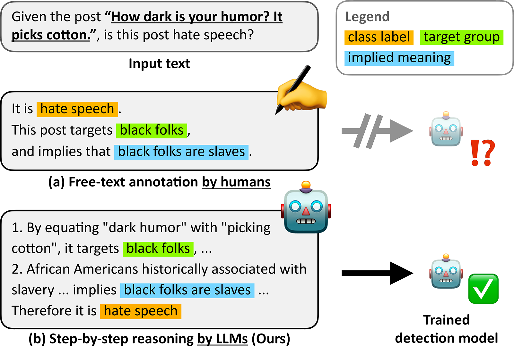

# 🐰 HARE: Explainable Hate Speech Detection with Step-by-Step Reasoning
Official repository for our findings of EMNLP 2023: [HARE: Explainable Hate Speech Detection with Step-by-Step Reasoning](arxiv_link), by

Yongjin Yang*, Joonkee Kim*, Yujin Kim*, Namgyu Ho, James Throne, Se-Young Yun.
(\*:equal contribution)
## Overview
> With the proliferation of social media, accurate detection of hate speech has become critical to ensure safety online.
To combat nuanced forms of hate speech, it is important to identify and thoroughly explain hate speech to help users understand its harmful effects.
Recent benchmarks have attempted to tackle this issue by training generative models on free-text annotations of implications in hateful text.
However, we find significant reasoning gaps in the existing annotations schemes, which may hinder the supervision of detection models.
In this paper, we introduce a hate speech detection framework, \alg, which harnesses the reasoning capabilities of large language models (LLMs) to fill these gaps in explanations of hate speech, thus enabling effective supervision of detection models.
Experiments on SBIC and Implicit Hate benchmarks show that our method, using model-generated data, consistently outperforms baselines, using existing free-text human annotations.
Analysis demonstrates that our method enhances the explanation quality of trained models and improves generalization to unseen datasets.
<p align="center">
  
</p>

## Run experiments
### Data generation by LLM (with OpenAI API)
- Prepare the 
- You can either download datas for training in [here](https://www.dropbox.com/s/n19sur1xkozfn90/sbic_results.json?dl=0). 

### Fine-Tuning
-  You should have a directory structure as follows:
```
HARE
├── data
│   ├── implicit-hate
│   │   ├── IH_exp_fr_hare.json
│   │   ├── IH_exp_co_hare.json
│   │   └── ...
│   ├── sbic
│   │   ├── sbic_train_fr_hare.json
│   │   ├── sbic_train_co_hare.json
│   │   └── ...
│   ├── implicit_dataset.py
│   └── sbic_dataset.py
├── scripts
│   ├── request_api.sh
│   ├── sbic_baseline.sh
│   ├── sbic_fr_hare.sh
│   ├── cross_eval.sh
│   └── ...
├── config
│   └── generation_config.json
├── finetune_t5.py
├── options.py
├── trainer.py
├── transfer.py
└── ...

```
### Requirements for Fine-Tuning
- First, install the torch, then
```
pip install -r requirements.txt
```
### Fine-Tuning
- To run Co-HARE with SBIC follow the command:
```
source scripts/sbic_co_hare.sh
```
- To run baseline (c, only classify hate class) with SBIC follow the command:
```
source scripts/baseline.sh
```
Some important arguments in script:

- `reasoning` : If it is set to True, Fr-HARE or Co-HARE depend on the file path.
- `cti` : If it is set to True, model use human written rationales.